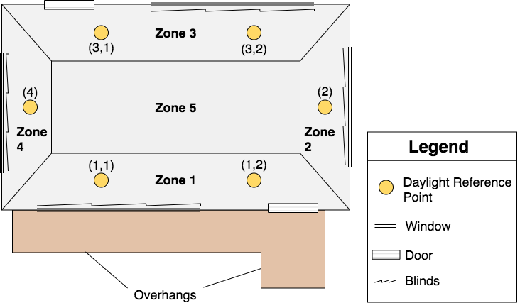

# On the Joint Control of Multiple Building Systems with Reinforcement Learning

This repository contains the code for [On the Joint Control of Multiple Building Systems with Reinforcement Learning](https://doi.org/10.1145/3447555.3464855). Please cite our paper if you find this work helpful:
```
Tianyu Zhang, Gaby Baasch, Omid Ardakanian, and Ralph Evins, "On the Joint Control of Multiple Building Systems with ReinforcementLearning", In Proceedings of the Twelfth ACM International Conference on Future EnergySystems (ACM e-Energy ’21), June 28–July 2, 2021
```
```Bibtex
@inproceedings{10.1145/3447555.3464855,
    author = {Zhang, Tianyu and Baasch, Gaby and Ardakanian, Omid and Evins, Ralph},
    title = {On the Joint Control of Multiple Building Systems with Reinforcement Learning},
    year = {2021},
    isbn = {9781450383332},
    publisher = {Association for Computing Machinery},
    address = {New York, NY, USA},
    url = {https://doi.org/10.1145/3447555.3464855},
    doi = {10.1145/3447555.3464855},
    booktitle = {Proceedings of the Twelfth ACM International Conference on Future EnergySystems},
    location = {Virtual Event, Italy},
    series = {e-Energy ’21}
}
```

## Description
This paper explores rule-based and RL-based control of building subsystems (HVAC, lighting, shading) in a 5-zone office building in Pittsburgh, Pennsylvania in January (heating season) and July (cooling season). The floor area of this building is 5,000 square feet. The control setpoints that we adjust using different algorithms to maximize energy savings, thermal comfort, and visual comfort are supply air temperature setpoint and blind angle setpoint. This [IDF](https://github.com/sustainable-computing/COBS-joint-control/blob/master/eplus_files/5Zone_Control_SAT_no_windowcontrol.idf) file describes the simulated building. The building is simulated in the [EnergyPlus](https://energyplus.net/) 9.3.0 environment and is controlled via the [COmprehensive Building Simulator (COBS)](https://github.com/sustainable-computing/COBS) which interacts with EnergyPlus. COBS is used in this work to programmatically execute rule-based control scenarios and to train the RL agents. The office building we control is depicted in the figure below.



This repository is licensed under [MIT](https://github.com/sustainable-computing/COBS-joint-control/blob/master/LICENSE). 
Code is written by [Tianyu Zhang](https://github.com/skyu0221) and [Gaby Baasch](https://github.com/gbaasch).

## Contributing
We welcome contributions to this work in different forms, such as bug reports, pull requests, etc.

## Prerequisites
Make sure to have [EnergyPlus](https://energyplus.net/) 9.3.0 installed on your computer. The code is not compatible with other version of EnergyPlus. Download the [COBS](https://github.com/sustainable-computing/COBS) simulator and add its path to your python environment to run the code correctly.

## Dependencies

| Packages      | Version       |
| ------------- |:-------------:| 
| pandas        | 1.1.5 |
| numpy         | 1.19.4 |
| matplotlib    | 3.3.3 |
| torch  | 1.7.1 |
| eppy | 0.5.53 |

## Usage
Execute the `main.py` by
```
python3 main.py [-h] [--start_run START_RUN] --end_run END_RUN [--seed SEED]
                [--chkpt_dir CHKPT_DIR] --agent_type AGENT_TYPE [--alpha ALPHA]
                [--automatic_entropy_tuning G] [--min_action MIN_ACTION]
                [--max_action MAX_ACTION] --network NETWORK
                [--reward_type REWARD_TYPE] [--reward_param REWARD_PARAM]
                [--power_mult POWER_MULT] [--therm_mult THERM_MULT]
                [--vis_mult VIS_MULT] [--planning_steps PLANNING_STEPS]
                [--save_root SAVE_ROOT] [--eplus_path EPLUS_PATH]
                [--epw_path EPW_PATH] [--control_sat CONTROL_SAT]
                [--control_therm CONTROL_THERM] --season SEASON --blinds BLINDS
                [--control_blinds_multi CONTROL_BLINDS_MULTI]
                [--zone_blinds_multi ZONE_BLINDS_MULTI] --daylighting
                DAYLIGHTING [--testing TESTING]
                [--random_occupancy RANDOM_OCCUPANCY]
                [--multi_agent MULTI_AGENT] [--load_sat LOAD_SAT]
                [--load_sat_path LOAD_SAT_PATH]
                [--no_train_split NO_TRAIN_SPLIT] [--vav VAV]
```

An example command would be:
```
python3 main.py --daylighting True --season heating --blinds False --control_blinds_multi False --random_occupancy True --vav False --multi_agent False --network leaky --control_sat True --load_sat False --load_sat_path '<path>' --control_therm False --power_mult 1.0 --therm_mult 0.7 --vis_mult 0.4 --save_root '<path>' --end_run 400 --agent_type PPO --reward_type OCTO --eplus_path '<path>'
```
